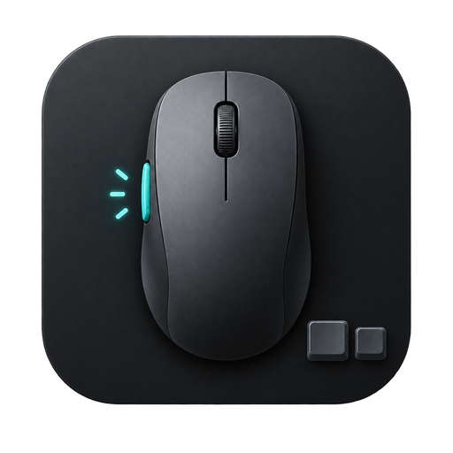
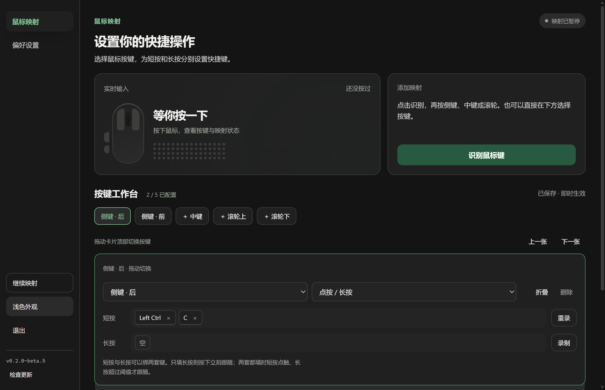

<div align="center">
  
  <h1>Mouse Insight</h1>
  <p><strong>看见系统刚收到哪颗鼠标键，再把它绑成键盘快捷键。</strong></p>
  <p>轻量级鼠标侧键与按键重映射工具。未配置的按键一律放行，纯本地运行，支持 Windows 与 macOS。</p>

  [](LICENSE)
  [](#下载与运行)
  [](#下载与运行)
  [](https://github.com/lingcang728/MouseInsight/releases)
</div>

---



## 市面上不是有各种鼠标驱动或改键工具吗？

有，比如大厂的配套驱动、或者功能大而全的 [X-Mouse Button Control](https://www.highrez.co.uk/downloads/xmousebuttoncontrol.htm)。但经常会遇到几件尴尬的事：

- **公模鼠标、办公鼠标根本没有驱动。** 比如狼途这类小众或平价鼠标，没有官方驱动，系统本身能收到侧键信号，但你想绑定的第三方软件（如 Typeless 语音输入、特定游戏或工作流工具）偏偏识别不到。
- **配置太重太繁琐。** 很多改键软件层级极多，改个键要翻好几层菜单；你甚至不确定系统底层到底把当前按下的侧键识别成了哪颗。
- **容易锁死鼠标或卡键。** 有些工具改错之后左键失灵，甚至在按住修饰键（如 `Ctrl + Alt`）修改配置后把按键永久卡在 Windows 系统底层。

Mouse Insight 解决的是这几件很具体的事：

- **先看见，再绑定。** 点一下「开始听」，按下鼠标上的任意按键，界面立刻高亮标出系统收到的是哪一颗，直接给它指定键盘快捷键。
- **左键右键永远放行。** 这是底线设计——左键与右键可以检测、可以在界面点亮指示，但**绝对不会被程序拦截或改写**，无论如何都不会把你的操作系统误操作锁死。
- **三种规范触发模式。** 支持「跟随按住」（按下立刻注入、松开立刻释放；点一下也会发短暂脉冲，不是长按阈值）、「单次触发」（回车/截图/独立动作）与「切换保持」（按一次保持、再按一次释放，UI 实时指示当前状态）。
- **按键状态机与引用计数。** 统一按键所有权（Key Ledger），按下时打快照，即使按住鼠标时修改了配置，松开时也只会精准释放原本按下的按键；多修饰键重叠时带引用计数，彻底杜绝误松开和按键卡死。
- **非阻塞调度与兼容性驻留。** 单次触发使用短暂的可控驻留时间提高热键兼容性，并通过非阻塞定时调度确保高频触发下事件不丢失、不阻塞工作线程与其它按键。
- **绝对紧急自救（EmergencyStop）。** 任何时候按键盘物理 `Pause` 或 `Scroll Lock` 键，Mouse Insight 会**无条件立即释放所有按下的虚拟键**，并无条件置为暂停状态（即使此前已经是暂停状态也会执行无条件释放）。恢复映射只能由用户通过界面「继续映射」或系统托盘菜单显式恢复，安全键不再承担切换恢复的职责，彻底杜绝卡键。
- **窗口关闭即释放内存。** 关闭主界面后会销毁控制面板，后台常驻系统托盘的纯 Rust 核心仅占用约 10MB 内存。

---

## 按键支持与能力矩阵

| 鼠标按键 | 映射支持 | 可用触发模式 | 行为与安全策略 |
| :--- | :---: | :--- | :--- |
| **侧键 · 后 (XButton1)** | ✅ 支持 | 跟随按住 / 单次触发 / 切换保持 | 匹配规则时拦截原鼠标事件，注入设定键盘快捷键；完整支持所有模式。 |
| **侧键 · 前 (XButton2)** | ✅ 支持 | 跟随按住 / 单次触发 / 切换保持 | 匹配规则时拦截原鼠标事件，注入设定键盘快捷键；完整支持所有模式。 |
| **鼠标中键 (Middle)** | ✅ 支持 | 跟随按住 / 单次触发 / 切换保持 | 匹配规则时拦截原鼠标事件，注入设定键盘快捷键；完整支持所有模式。 |
| **滚轮上滚 (Wheel Up)** | ✅ 支持 | **仅支持「单次触发」** | 滚轮属于瞬时脉冲无持续按住状态，不支持跟随按住与切换保持。 |
| **滚轮下滚 (Wheel Down)** | ✅ 支持 | **仅支持「单次触发」** | 滚轮属于瞬时脉冲无持续按住状态，不支持跟随按住与切换保持。 |
| **鼠标左键 (Left)** | ❌ 仅检测 | 不允许建立映射 | 安全底线：仅检测，绝不干预，绝不拦截，防止误操作锁死系统。 |
| **鼠标右键 (Right)** | ❌ 仅检测 | 不允许建立映射 | 安全底线：仅检测，绝不干预，绝不拦截，防止误操作锁死系统。 |
| **未配置的按键** | — | — | 一律原样交还给操作系统处理，零副作用。 |

---

## 下载与运行

到 [Releases](https://github.com/lingcang728/MouseInsight/releases) 页面下载最新版本。当前提供 **Windows 10 / 11** 与 **macOS 10.15+**（Universal，同时支持 Apple Silicon 与 Intel）。

### Windows

#### 方式一：绿色便携版（推荐）
1. 下载 `Mouse Insight.exe`，放到你喜欢的文件夹里（无需安装，解压即用）；
2. 本地打包目录将便携标记与映射配置放在 `data/.portable`、`data/config.json`。首次手动部署单文件版时，创建这份标记即可启用便携模式；旧版同级 `.portable` 与 `config.json` 仍兼容；
3. 支持完整的开机自启（在界面勾选「开机自启动」后，开机静默常驻托盘，不弹窗打扰）。

#### 方式二：标准安装包
1. 下载 `Mouse Insight_<版本>_x64-setup.exe` 并运行安装；
2. 安装至当前用户目录，不需要管理员权限。

> [!NOTE]
> **关于 Windows SmartScreen 提示**：  
> 本项目为开源项目，Windows 版未购买商业代码签名证书。首次运行时如果 Windows 提示「未知发布者」，点击 **「更多信息」→「仍要运行」** 即可。本项目的每一行源码均开源在 GitHub 上。

### macOS

1. 下载 Universal DMG（文件名类似 `Mouse Insight_<版本>_universal.dmg`）；
2. 打开 DMG，把 **Mouse Insight** 拖进 `Applications`；
3. 从「应用程序」启动。

首次使用必须授予 **辅助功能（Accessibility）** 权限，否则无法监听或拦截鼠标侧键：

1. 打开 **系统设置 → 隐私与安全性 → 辅助功能**；
2. 打开 **Mouse Insight** 开关。

程序启动时会向系统请求该权限。若列表里还没有 Mouse Insight，先启动一次应用，再回到设置页刷新。

### 菜单栏与托盘

macOS 点击菜单栏的鼠标图标可直接查看监听与映射状态、暂停/恢复映射、打开控制面板、配置目录、辅助功能设置或版本下载页。图标和下拉菜单采用系统原生绘制，跟随系统深浅色和菜单高亮，不额外创建网页窗口，也不轮询状态。

- `⌘,` 打开控制面板，`⌘⇧P` 暂停/恢复映射，`⌘Q` 释放注入按键后退出。这些是应用菜单快捷键，不会注册为全局热键。
- 关闭控制面板会销毁窗口并释放 WebView；后台映射继续运行。可从菜单栏或 Dock 重新打开；`⌘H` 隐藏后也可恢复。
- 授权失败时菜单显示「监听不可用」，可直接进入辅助功能设置。首次授权后请退出并重新启动应用。
- Windows 右键托盘提供相同的状态与快捷入口（不含 macOS 辅助功能设置），左键打开控制面板。

Mouse Insight 需要辅助功能，是因为它要：

- 监听鼠标侧键、中键和滚轮；
- 拦截已经被映射的鼠标事件，避免原按键和键盘快捷键叠在一起；
- 按你的配置注入键盘快捷键。

当前实现使用 `CGEventTap` 的可修改事件点，权限以 **辅助功能** 为准。不需要再单独打开「输入监控（Input Monitoring）」。

安装版配置保存在 `~/Library/Application Support/MouseInsight/config.json`。

> [!NOTE]
> **关于 macOS Gatekeeper**：正式签名并公证过的 DMG 一般可以直接打开。若系统仍提示无法验证开发者，打开 **系统设置 → 隐私与安全性**，在被拦截的应用旁选择仍要打开。

---

## 使用步骤

1. **退出冲突软件**：若你正在运行 X-Mouse Button Control 等其他全局鼠标钩子软件，请先退出，两套全局钩子不可同时监听相同按键；
2. **监听鼠标键**：打开 Mouse Insight，点击 **「识别鼠标键」**，按下鼠标上想要改写的那颗按键（如侧键）；
3. **录制键盘组合**：界面弹出键盘录制遮罩后，在键盘上按下你想要触发的组合键（如 `Left Ctrl + Left Alt` 或 `Enter`），点击 **「保存映射」**；
4. **即时生效**：之后按下对应的鼠标键，系统便会自动触发对应的快捷键。

* 也可以在「按键工作台」直接选择侧键、中键或滚轮，并使用复制、粘贴、撤销、回车预设。复制等预设在 Windows 使用 Ctrl，在 macOS 使用 Command。
* 侧键与中键支持「点按 / 长按」和「切换保持」：只填写短按时单次触发，只填写长按时按下立刻跟随；两套都填时用长按阈值区分。滚轮只支持单次触发。
* 编辑后自动保存，界面显示保存结果。录制可以取消；识别在 15 秒后自动结束，切换到其他窗口也会结束录制与识别。
* 关闭窗口后程序会自动缩入系统托盘，单击托盘图标可重新打开主窗口；若要完全退出，点击窗口底部的「退出」或在系统托盘右键选择退出。

---

## 三种触发模式的实际区别

| 触发模式 | 行为机制 | 典型适用场景 | 状态反馈与支持 |
| :--- | :--- | :--- | :--- |
| **跟随按住 (Hold)** | 鼠标按下立刻注入快捷键，松开立刻释放。点一下也会走出完整的 Down→Up，**不是**「按住超过 N 毫秒才触发」。松开时只释放本次真正拥有的映射键。 | **修饰键组合与语音输入**。例如映射为 `Ctrl + Alt`（Typeless 语音输入），鼠标侧键按住说话，松开即完成输入。 | 侧键前/后、中键完整支持。激活时 UI 实时显示「按住中」。 |
| **单次触发 (Click)** | 每按一下鼠标，完整触发一次快捷键。每次鼠标按下产生一次完整的键盘按下/松开脉冲，长按鼠标不产生重复连打。 | **单次独立动作**。例如绑定 `Enter` 回车、截图快捷键、`Esc` 或保存文件等独立动作。 | 侧键前/后、中键、滚轮上下滚完整支持。 |
| **切换保持 (Toggle)** | 按一次保持按住，再按一次释放。鼠标松开事件本身不改变 toggle 状态。暂停、紧急停止、配置变更或程序退出时无条件释放。 | **长时间自锁保持**。例如游戏中按一下侧键保持自动奔跑、专业软件工具切换、自由麦常开常关。 | 侧键前/后、中键完整支持。UI 实时显示当前处于「保持中」还是「已关闭」。 |

> [!NOTE]
> **关于单次触发与驻留时间的标准规范表述：**  
> 单次触发使用一个短暂的可控驻留时间，以提高部分全局热键应用对模拟按键的兼容性。驻留时间属于兼容性策略，应由实测确定。Microsoft SendInput 保证输入事件按顺序插入，单次触发通过非阻塞调度避免阻塞其他按键。每个按键最多排队 8 次单次触发，超出部分不再积压；原生输入事件队列溢出时自动暂停并释放已保持的键，请从界面恢复。

---

## 常见问题 FAQ

**为什么在某些软件（如部分游戏或任务管理器）里按键不响应？**  
这是 Windows 的 UIPI（用户界面特权隔离）安全保护机制。标准权限运行的程序无法向以管理员权限运行的高特权窗口注入按键。若你需要在管理员权限软件中使用映射，只需右击 Mouse Insight 选择**「以管理员身份运行」**即可。

**按键卡死或误操作了怎么自救？**  
随时按下键盘物理 **`Pause`** 或 **`Scroll Lock`** 键。Mouse Insight 会**无条件立即释放所有按下的虚拟键**，并无条件置为暂停状态（即使此前已经是暂停状态也会执行无条件释放）。恢复映射只能由用户通过界面「继续映射」或系统托盘菜单显式恢复，安全键不再承担切换恢复的职责，彻底杜绝卡键。

**程序占用资源大吗？**  
关主窗口会销毁控制面板（Windows 上是 WebView2），后台只留钩子引擎；点托盘会重建控制面板。若托盘单击无响应，用右键菜单「打开控制面板」。

**我的配置保存在哪里？换电脑或更新会丢吗？**  
Windows 便携版存放在程序目录下的 `data/config.json`（旧版同级 `.portable` 布局仍读取同级 `config.json`）；Windows 安装版存放在 `%APPDATA%\MouseInsight\config.json`；macOS 安装版存放在 `~/Library/Application Support/MouseInsight/config.json`。配置保存采用临时文件刷盘与原子重命名机制，并维护 `.bak` 备份，降低意外中断时丢失配置的风险。Windows 更新程序时只需替换 exe，配置完整保留。

**macOS 上侧键没反应？**  
先确认 **系统设置 → 隐私与安全性 → 辅助功能** 里已经打开 Mouse Insight。该权限被关掉时，全局事件点创建会失败，控制面板会显示授权提示。授权后请重新启动应用。系统临时禁用事件点时，应用会暂停映射、释放按键并重新启用监听，之后请手动恢复映射。

**它会收集我的按键记录吗？**  
绝对不会。Mouse Insight 为 100% 纯本地运行的离线工具，没有配置任何后端服务器。「检查更新」只会读取 GitHub 最新稳定版的版本信息；你点击发行说明或下载按钮时才打开发布页面。请求最多等待 8 秒，成功结果在当前窗口内缓存 5 分钟。程序，绝不记录、存储或上传任何键鼠隐私数据。

---

## 从源码构建

项目基于 Tauri 2 + Rust + TypeScript 构建。本地需要具备 [Node.js](https://nodejs.org/) 与 [Rust](https://rustup.rs/) 开发环境。

```powershell
# 1. 安装前端依赖
npm install

# 2. 启动开发模式
npm run tauri:dev

# 3. Windows 本地打包发布产物（便携版 exe + NSIS 安装包）
npm run package:release
```

打包脚本先验证新程序与安装包，再替换本地 `release/`，不会创建 Tag 或发布 GitHub Release。运行中的便携版请先从托盘退出；自动替换当前实例可使用 `powershell -NoProfile -ExecutionPolicy Bypass -File scripts/package-release.ps1 -StopRunningApp`。原配置按原字节迁移到 `release/data/`，旧文件备份到 `%LOCALAPPDATA%\MouseInsight\package-backups/`。

`release/` 根目录只保留便携程序与当前版本安装包；`assets/` 保存快捷方式图标，`metadata/` 保存待发布版本信息与校验和，`data/` 保存便携标记和用户配置。分享软件时不要分发自己的 `data/config.json`。本地验证通过后再按发布流程打 Tag。

macOS 开发机可同样使用 `npm run tauri:dev`。正式 Universal DMG 由 GitHub Actions 在 `v*` tag 上签名、公证后上传到 Draft Release，不走 Windows 的 `package-release.ps1`。

---

## 许可证

[MIT License](LICENSE)
